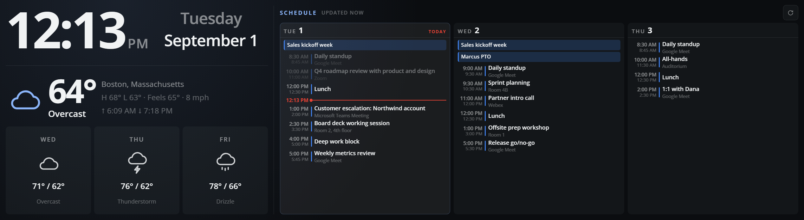
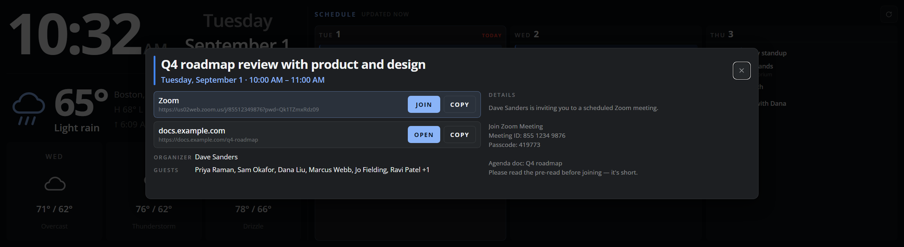

# Business Info Center — iCUE 5 widget for CORSAIR XENEON EDGE

A single-pane dashboard for the 2536×696 slot. Left third is a clock, the long-form date
and current weather; right two thirds are Google Calendar day columns in an agenda layout
with a red now-line. Tap an event to see the invite and launch its meeting link.

> **Calendar support needs a companion proxy.** Google serves ICS feeds without CORS
> headers, so the widget cannot read them directly. Get it here:
> **[expressProxyforGoogleCalendar](https://github.com/davidsauro/expressProxyforGoogleCalendar)**
> — clone, `npm install`, `npm start`. The clock and weather work without it.

```
┌──────────────────────────┬─────────────────────────────────────────────────────┐
│               Tuesday    │  SCHEDULE  UPDATED NOW                         [⟳]  │
│  10:09 AM  September 1   │  ┌───────────────┐ ┌──────────────┐ ┌─────────────┐ │
│  ────────────────────────│  │ TUE 1  TODAY  │ │ WED 2        │ │ THU 3       │ │
│         Boston, MA       │  │ ▌Sales kickoff│ │ ▌Sales kickoff│ │8:30 ▌standup│ │
│   ☁ 68°  H 68° L 62°     │  │10:00 ▌Q4 review│ │9:00 ▌standup │ │10:00 ▌All-hands│
│   Drizzle  ↑6:09 ↓7:18   │  │━10:09━━━━━━━━━│ │9:30 ▌planning│ │12:00 ▌Lunch │ │
│  ┌───────┬───────┬──────┐│  │11:00 ▌debrief │ │11:00 ▌intro  │ │2:00 ▌1:1 Dana│ │
│  │  WED  │  THU  │ FRI  ││  │11:30 ▌vendor  │ │1:00 ▌offsite │ │3:00 ▌deep   │ │
│  │   ☁   │   ⛈   │  ☂   ││  │12:00 ▌Lunch   │ │3:30 ▌1:1     │ │             │ │
│  │ 71/62 │ 76/63 │ 78/66││  │ 1:00 ▌escal.  │ │5:00 ▌go/no-go│ │             │ │
│  │Overcast│Thunder│Drizzle││ │      ↓ 2 more │ │              │ │             │ │
│  └───────┴───────┴──────┘│  └───────────────┘ └──────────────┘ └─────────────┘ │
└──────────────────────────┴─────────────────────────────────────────────────────┘
```



*Rendered at the real slot size with the bundled calendar fixture and live weather.*

## Prerequisites

The calendar half needs a companion proxy, because `calendar.google.com` sends no CORS
headers and the widget's page origin is `file://`:

**[expressProxyforGoogleCalendar](https://github.com/davidsauro/expressProxyforGoogleCalendar)**

```bash
git clone git@github.com:davidsauro/expressProxyforGoogleCalendar.git
cd expressProxyforGoogleCalendar && npm install && npm start   # listens on :8010
```

It must be running whenever the widget is on screen, or the schedule shows `OFFLINE`. The
widget's Proxy setting defaults to `http://localhost:8010`, which is where that project
listens.

Weather needs nothing — Open-Meteo allows cross-origin requests directly.

## Layout of the repo

```
src/                     everything that gets installed into iCUE
  manifest.json          widget identity + capabilities
  index.html             entry point; settings declared as <meta> in <head>
  styles/main.css        slot-responsive layout, sized in vh
  js/icue-bridge.js      wrapper over the iCUE host API (reusable in any widget)
  js/feed-url.js         rewrites Google ICS addresses onto the local proxy
  js/links.js            pulls joinable meeting links out of an invite
  js/color.js            normalises iCUE's Qt colour strings into CSS
  js/ics.js              RFC 5545 reader: recurrence, timezones, overrides
  js/weather.js          Open-Meteo client
  js/app.js              layout and rendering
  translation.json       localizable strings
  resources/icon.svg     picker icon
  resources/fonts/       bundled Open Sans (Apache-2.0), one variable woff2
test/                    unit tests + fixtures, no dependencies beyond node
docs/icue-widget-api.md  the widget API, reverse-engineered from Corsair's own widgets
tools/preview.sh         serve for browser development
tools/serve.py           dual-stack static server used by preview.sh
tools/logs.sh            what iCUE says about widgets, from its own log
tools/make-sim.py        generates a fake-iCUE-host page for browser debugging
tools/deploy.sh          install into iCUE / uninstall
```

## Develop

Work in Chrome first; restarting iCUE for every change is painfully slow.

```bash
./tools/preview.sh
```

That prints ready-made URLs, including one using the bundled busy-calendar fixture. Outside
iCUE the bridge falls back to each property's declared default and lets `?name=value` in
the URL stand in for the settings panel, so the real UI renders with devtools available.
Size the window to 2536×696.

```bash
./test/run.sh
```

59 tests covering the ICS reader (recurrence, DST, EXDATE, RECURRENCE-ID, folding,
all-day anchoring), the proxy URL rewriting, and the settings bridge (including that a ZIP
code keeps its leading zero — `02110` coerced to a number becomes a Belgian postcode).

## Run it on the device

There is no build step — a widget is static files, and `deploy.sh` copies them into place.

```bash
./tools/deploy.sh
```

It generates a GUID folder on first run (kept in `.widget-id` so later deploys reuse it),
validates the manifest, checks the proxy is reachable, and copies `src/` into
`%APPDATA%\Corsair\CUE5\html_widgets\<guid>\`.

**Then fully quit iCUE from the tray icon and relaunch it.** Closing the window is not
enough; iCUE only scans for widgets at startup.

Confirm iCUE accepted it — this is the step worth not skipping, because a rejected widget
simply never appears in the picker with no visible explanation:

```bash
./tools/logs.sh | grep -i businessinfocenter
```

You want a matching pair for your GUID folder:

```
I cue.mod.widgets.html_cache: Found widget file: ".../html_widgets/<guid>/index.html" Starting validation...
I cue.mod.widgets.html_cache: Widget file ".../html_widgets/<guid>/index.html" is succesfully validated
```

No lines at all means iCUE never saw the folder. "Starting validation" with no "validated"
means the manifest or `index.html` was rejected.

Finally, in iCUE: pick the XENEON EDGE, open the dashboard editor, add **Business Info
Center** to the extra-wide (2536×696) slot, and fill in a calendar URL and a location.

To iterate: `./tools/deploy.sh` again, then restart iCUE again. To uninstall:
`./tools/deploy.sh --remove`.

### Debugging on the device

Widget `console.log` reaches **no log file** — verified against every log in
`%LOCALAPPDATA%\Corsair\Logs\CUE5`. So the widget reports its own state instead.

**Turn on `Diagnostics`** in the widget's settings (Troubleshooting group). A readout
appears on the widget showing how it booted, whether `tr` and `iCUE_initialized` were
visible, every setting with whether it came from the host or a declared default, the
calendar and weather status, and any captured errors with file and line. It also appears
**automatically** whenever something throws, even with the switch off — a silent failure
should never look like an empty calendar.

The iCUE log still tells you whether the install was accepted and which plugins loaded:

```bash
./tools/logs.sh --follow      # widget-related iCUE log lines, live
```

Two lines there look alarming and are noise, present for Corsair's own widgets too: a
`TypeError` about `rowCount` from `TabButtonsEditorSetting.qml`, and
`Empty translation for language: "en_FAKE"`.

**Reproduce host bugs in the browser.** Plain preview can't catch them, because outside
iCUE the bridge takes a different boot path:

```bash
python3 tools/make-sim.py --diagnostics
# then open http://localhost:8123/src/sim.local.html
```

That fakes the real host: `tr()` present, settings as injected globals, colours in Qt's
serialisation, and `iCUE_initialized` as a `const` so it's absent from `window`.

iCUE also appears to ship a remote DevTools hook: `iCUE.exe` contains a
`cue.widgets.webengine_debug` logging category and the strings *"QtWebEngine remote
debugging enabled on port:"* and *"Open in browser: http://localhost:"*. If you can trigger
it you get a real Chrome DevTools session against the live widget. The exact switch is
unconfirmed — try launching iCUE with `QT_LOGGING_RULES=cue.widgets.webengine_debug.debug=true`
or with `QTWEBENGINE_REMOTE_DEBUGGING=9222` set — and the log prints the port it picked.
See [docs/icue-widget-api.md](docs/icue-widget-api.md).

## Configure

| Setting | Notes |
| --- | --- |
| Calendar 1–3 | Paste the **secret address in iCal format** from Google Calendar → Settings → *your calendar* → Integrate calendar. Feeds are colour-coded blue / green / purple in that order. |
| Proxy | Base URL of the [companion proxy](https://github.com/davidsauro/expressProxyforGoogleCalendar). Default `http://localhost:8010`, which is where it listens. |
| Days Shown | 1–5 day columns. |
| Refresh | Poll interval, 1–60 min. |
| Location | A **US ZIP code** (`02110`), a city name (`Boston`), or coordinates (`42.36,-71.06`). The resolved city is displayed on the widget so you can confirm it guessed right. |
| Temperature Units | °F / °C |
| Time Zone / Time Format | Clock and all event times. |
| Text / Accent / Secondary Accent / Background / Transparency | Under **Widget Personalization**. These are the same five names iCUE's device-level *Pages personalization* panel drives, so they follow that panel unless you override them here. |

You paste the ordinary Google address; the widget rewrites `calendar.google.com/calendar/…`
to `<proxy>/proxy/calendar/…` itself. A non-Google feed that already sends CORS headers is
used directly, with no proxy involved.

## Tapping an event



Tap any event row or all-day chip to open the invite. The panel shows the title, the time,
the organiser and guests, the description with HTML stripped, and every link found in the
invite — with the joinable ones first and labelled by service.

Links are gathered from wherever the originating system put them: `X-GOOGLE-CONFERENCE`
(Meet), `X-MICROSOFT-SKYPETEAMSMEETINGURL` (Teams), the RFC 7986 `CONFERENCE` field, a
URL-shaped `LOCATION` (how Zoom and Webex do it), `href`s and bare URLs in the description,
and the calendar's own event page. Known hosts — Meet, Zoom, Teams, Webex, Chime, GoTo,
BlueJeans, Whereby, Jitsi — are named and sorted first.

Each link offers three routes, in descending order of convenience:

1. **JOIN / OPEN** hands the URL to Windows via iCUE's `linkprovider` plugin, which calls
   `Qt.openUrlExternally`. An `https://` link opens in your default browser; a registered
   scheme opens its client.
2. **COPY** puts the URL on the PC clipboard.
3. The **full URL is printed** under each label, selectable, so you can read it off the
   panel and type it by hand if the first two fail.

Every action reports back in the panel — "Opening on your PC…", "Link copied", or an
explicit failure. Nothing fails silently.

Close with the ✕, by tapping outside the panel, or with Escape. The panel sits outside the
agenda's DOM, so the once-a-minute refresh cannot pull it out from under you mid-read.

## Page personalization

The widget honours iCUE's device-level **Pages personalization** panel — widget text
colour, accent colour, background colour and transparency — because those settings reach a
widget by overriding properties with specific well-known names. It declares all five
(`textColor`, `accentColor`, `accentColor2`, `backgroundColor`, `transparency`), so each
control in that panel applies. Setting any of them in the widget's own settings overrides
the page value.

Two things make this easy to get wrong, both documented in
[docs/icue-widget-api.md](docs/icue-widget-api.md):

- **A property you don't declare cannot be driven.** There is no opt-in flag; the control
  just silently does nothing.
- **The colours are not CSS.** iCUE hands over Qt's serialisation — `rgb(1 1 1)` for white
  and sometimes `hsv(…)`. Assigned directly, the first renders near-black (CSS reads
  unitless `rgb()` as 0-255) and the second is dropped, because CSS has no `hsv()`.
  [`src/js/color.js`](src/js/color.js) normalises both.

Transparency fades the widget's own background layer only, so text stays legible while the
device background shows through. Despite the name it is an opacity percentage, matching
Corsair's own widgets.

## Behaviour worth knowing

- **The now-line** is spliced into today's column between the last event that started and
  the next one, and moves every minute. Finished events dim to 40%.
- **Overflow.** Nothing scrolls on the device. Columns fit as many rows as the height
  allows and show `↑ N earlier` / `↓ N more`. Today drops past events first, so what is
  coming up always stays visible.
- **Stale data.** The last good fetch is cached in `localStorage` (namespaced by the widget
  instance's `uniqueId`) and shown with a `STALE` badge if a refresh fails.
- **Empty vs unknown.** A day only says "Nothing scheduled" when a feed actually loaded.
  Offline or unconfigured columns stay blank rather than claiming the day is free.
- **Row subtitles** name the service rather than showing a raw URL: a `LOCATION` of
  `https://us02web.zoom.us/j/855…` reads as "Zoom", and an event whose only clue is a
  conference field still gets labelled.
- **Recurring events** are expanded locally: RRULE with INTERVAL / COUNT / UNTIL / BYDAY
  (including ordinals like `2TH`) / BYMONTHDAY / BYMONTH, plus RDATE, EXDATE and
  RECURRENCE-ID overrides. Wall-clock times survive DST transitions.

## Troubleshooting

**Schedule shows `OFFLINE`.** Hover the status text for the underlying error (it is set as
the element's `title`). Usually the proxy is not running. Check:

```bash
curl -s http://localhost:8010/health          # expect: ok
curl -s http://localhost:8010/tiny.ics        # expect: a one-event VCALENDAR
```

Start it with `npm start` in the
[proxy repo](https://github.com/davidsauro/expressProxyforGoogleCalendar).

**The proxy runs in WSL but iCUE runs on Windows.** That works, but only via the hostname
`localhost` — Windows resolves it to the IPv6 loopback, which WSL forwards. Literal
`127.0.0.1:8010` from Windows does *not* reach it. Keep the Proxy setting as
`http://localhost:8010`.

**Weather is for the wrong place.** Open-Meteo's geocoder resolves US ZIP codes and city
names, but **not** Canadian or UK postcodes, and an ambiguous name like `Springfield` gets
the largest match (Missouri). The widget always prints the city it resolved to, so you can
see when this happens — put coordinates in the Location field instead, e.g. `42.36,-71.06`.

**Weather says `WEATHER UNAVAILABLE`.** The reason is shown underneath it.

**A change to the widget does nothing.** iCUE caches aggressively. Quit it from the tray
icon — not just closing the window — then relaunch.

**The widget shows only placeholder dashes, a degree sign and a cloud.** That is the
static HTML — nothing ever ran. Turn on `Diagnostics`; `booted via` tells you whether the
bridge started at all. Historically this was caused by reading `iCUE_initialized` off
`globalThis` when the host had injected it as a `const`, so the widget waited forever for
an init event that had already fired. There is now a watchdog that boots anyway after a
couple of seconds.

**A Pages personalization setting does nothing.** Check the property is declared in
`index.html` — an undeclared name is simply never delivered. If a colour applies but comes
out black, it arrived as Qt's normalised `rgb(0..1)` form and is not going through
`Color.toCss()`.

**JOIN does nothing.** The `linkprovider` plugin only exists inside iCUE, so in browser
preview the panel reports "Could not open — copy the link instead". On the device, if it
still fails, the plugin object may be under a different name than the four this widget
probes — see the linkprovider section in [docs/icue-widget-api.md](docs/icue-widget-api.md).
COPY and the printed URL are the fallbacks either way.

**COPY says it failed in preview but works on the device.** `navigator.clipboard` requires
a secure context. `file://` (iCUE) and `http://localhost` qualify; `http://<LAN-IP>` does
not. Use the localhost URLs `preview.sh` prints, not the IP.

**Font errors in browser preview.** There should be none: the widget bundles Open Sans as
a relative-path woff2 rather than using Corsair's `qrc:/fonts/…` resources. If you see a
font load failure mentioning `qrc:`, something has reintroduced that scheme — it is a Qt
internal that plain Chrome cannot resolve, and Chrome reports the failure as if it were a
CORS block. See the Fonts section in [docs/icue-widget-api.md](docs/icue-widget-api.md).

## Reference material on this machine

Corsair's own widgets are the real documentation, 19 of them in readable source:

```
C:\Program Files\Corsair\CORSAIR iCUE5 Software\widgets\
```

`DigitalClock1` is the clearest introduction, `Weather` shows the Open-Meteo integration
this widget borrows from, `Sensor` shows the plugin/WebChannel pattern, and `Calendar` and
`StreamDeck` are the interactive ones. See [docs/icue-widget-api.md](docs/icue-widget-api.md).

## License

Apache License 2.0 — see [LICENSE](LICENSE).

The bundled typeface, `src/resources/fonts/OpenSans-Variable-latin.woff2`, is Open Sans,
also Apache-2.0; its notice is in [src/resources/fonts/LICENSE.txt](src/resources/fonts/LICENSE.txt).

Weather data comes from [Open-Meteo](https://open-meteo.com/) (CC BY 4.0 for the data,
free for non-commercial use). This project is not affiliated with or endorsed by Corsair.
The API notes in [docs/icue-widget-api.md](docs/icue-widget-api.md) were derived by reading
the widgets that ship with iCUE 5 on the author's own machine.
